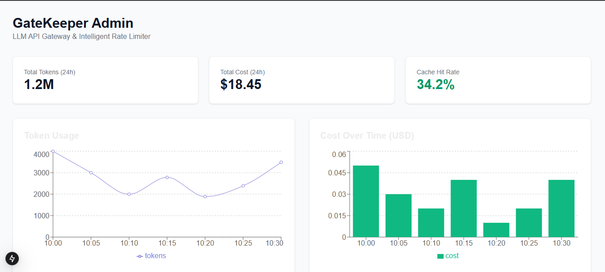
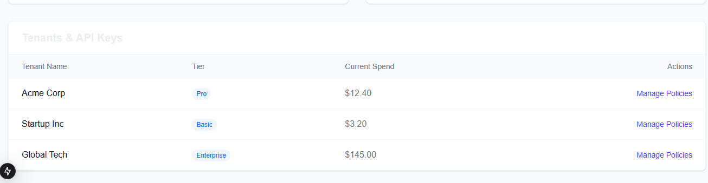
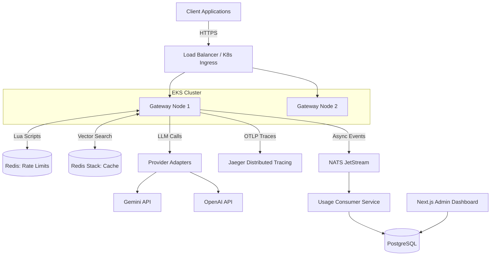

# GateKeeper

<div align="center">
  
</div>


**GateKeeper** is an API Gateway and intelligent rate limiter purpose-built for LLM traffic. It provides multi-algorithm token-aware rate limiting, multi-provider failover routing, semantic caching, asynchronous cost tracking, and comprehensive observability.

### Admin Dashboard Overview
<div align="center">
  
  <br />
  
</div>

---

## 🎯 Problems This Solves

Generic rate limiters count requests, not tokens, leaving LLM providers vulnerable to token-blind bursts that blow through budgets. **GateKeeper** solves this by estimating tokens before forwarding requests, atomically reserving quota in Redis, and reconciling actual usage post-response. It also mitigates provider downtime with automatic failover (e.g., Gemini → Anthropic) and reduces LLM spend via semantic vector caching of identical queries.

---

## 🏗 Architecture



---

## 🚀 Features

### 1. Multi-Algorithm Token Limiter
Four distinct rate limiting algorithms, configurable per tenant:
- **Token Bucket:** Smooth bursts, ideal for LLM traffic (Default).
- **Sliding Window Log:** Exact tracking, higher memory cost.
- **Sliding Window Counter:** Approximate tracking, memory-efficient.
- **Fixed Window:** Simple but vulnerable to boundary bursts.

### 2. Multi-Provider Routing & Circuit Breaker
Seamless routing across Google Gemini, OpenAI, and Anthropic. Key pooling multiplies throughput, and built-in circuit breakers instantly failover to fallback providers during outages.

### 3. Semantic Caching
Using Redis Stack's Vector Search (FT.SEARCH), repeated prompts with high cosine similarity bypass the LLM entirely, yielding `<5ms` responses and saving 100% of the token cost.

### 4. Async Usage Pipeline
The hot path is decoupled from analytics. Usage events are non-blocking, published to NATS JetStream, and persisted to PostgreSQL by a dedicated consumer service.

---

## 💻 Tech Stack & Design Decisions

| Component | Choice | Rationale |
| :--- | :--- | :--- |
| **Core Gateway** | Go 1.23 | Unmatched concurrency (Goroutines) and low latency. Standard for infra tooling. |
| **State Store** | Redis + Lua | Atomic `EVAL` scripts prevent race conditions in distributed token decrements. |
| **Message Queue** | NATS JetStream | Ultra-lightweight asynchronous event streaming. Offloads Postgres writes from the hot path. |
| **Semantic Cache** | Redis Stack | Built-in Vector similarity search using Cosine distance. |
| **Dashboard** | Next.js 15 | Modern, React-based admin panel with TailwindCSS and Recharts for live telemetry. |

---

## 📈 Performance Benchmarks

GateKeeper aims to be virtually invisible in your network hop.

* **Target Overhead:** `<10ms` p50, `<30ms` p99 latency overhead.
* **Throughput:** Tested at `>5,000 RPS` locally via `k6`. Adding gateway nodes linearly scales capacity because the system is fully stateless.

To run the load test:
```bash
k6 run load-tests/script.js
```

---

## 🛠 Getting Started

### 1. Prerequisites
- Docker & Docker Compose
- Node.js (for Next.js dashboard)
- Go 1.23+

### 2. Launch Infrastructure
```bash
docker-compose -f deploy/docker-compose.yml up -d
```
This spins up Redis Stack, PostgreSQL, NATS, and a mock LLM server.

### 3. Run the Gateway
```bash
go mod tidy
go run cmd/gateway/main.go
```

### 4. Run the Usage Consumer
```bash
go run cmd/usage-consumer/main.go
```

### 5. Launch the Admin Dashboard
```bash
cd dashboard
npm install
npm run dev
```
Visit `http://localhost:3000` to view live usage telemetry.

---
*Built as a production-grade infrastructure showcase.*
